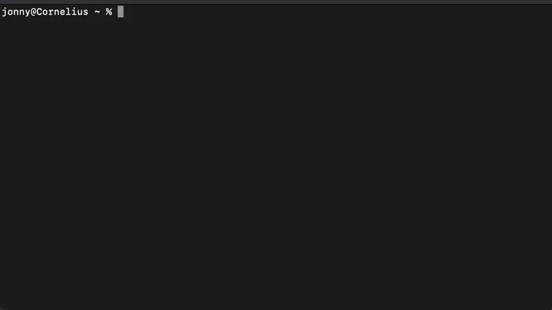

# orch-estrator 🍊

`orchestrator` is a simple tool for launching your frontend/backend services locally, in parallel, in order to closely approximate and troubleshoot your e2e infrastructure without reaching for something heavier-weight, like containers.

To do this it utilises `tmux`, a terminal multiplexing utility, to spawn each service as a virtual window within a single navigable session, as well as automatically doing all of the environment variable plumbing necessary for the services to communicate with eachother.

This tool provides a CLI which prompts you to select which services you'd like to launch, from a list you configure yourself:

    

## Prerequisites
- node/npm: https://nodejs.org/en/download
- tmux: https://github.com/tmux/tmux/wiki/Installing

## Configuring
- This script will create config files from defaults in `./config.shadow` if they don't already exist.
- Update `./config.toml` to configure the CLI and how services are launched. Take a look at the file's comments for a description of each field.
- Update the exported function in `./src/hydrateService.js` to customise the logic for defining each service's config at runtime.
    - By default this function just calls into `./src/utils.js#defaultHydrateService()`, which itself is a useful reference for how service hydration can work.
    - For example, it switches on each service's group and populates each `env` field with the variables it needs to communicate with its downstream services.

# Usage
- Run `npm ci && npm link` in the root of the directory to install the package and enable running the `orchestrate` command globally.
- This command will list the services as defined in `config.toml#services` and will prompt you to select which services you'd like to run in tandem.
- Use the arrow keys to navigate choices, space to toggle a selection, and enter to proceed.
- `orchestrate` will spawn each service selected within the same tmux session in its own window.
- It will also automatically spawn a service not listed, namely the service for a graphql gateway / supergraph. This service can be specified by environment variables (as detailed later in this section).
- Finally this tool will automatically attach itself to the tmux session
    - You can navigate to prev/next windows with `<PREFIX>,p` / `<PREFIX>,n` respectively
    - The default tmux `<PREFIX>` is `ctrl+b`
